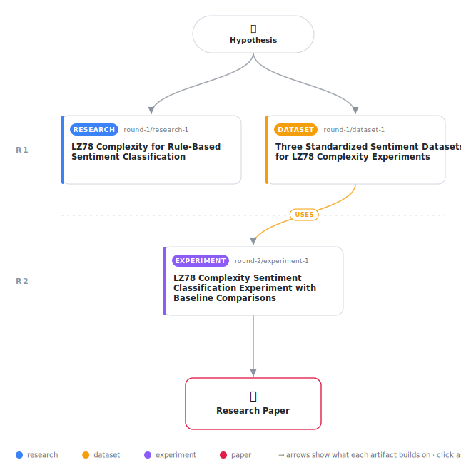

# LZ78 Complexity for Rule-Based Sentiment Classification: An Empirical Investigation

<div align="center">

<a href="https://cdn.jsdelivr.net/gh/AMGrobelnik/ai-invention-a81b4f-lz78-complexity-for-rule-based-sentiment@main/workflow.svg">
<picture>
  <source media="(prefers-color-scheme: dark)" srcset="workflow-dark.svg">
  
</picture>
</a>

<sub>🖱️ <b><a href="https://cdn.jsdelivr.net/gh/AMGrobelnik/ai-invention-a81b4f-lz78-complexity-for-rule-based-sentiment@main/workflow.svg">Open the interactive diagram</a></b> — every card links to its artifact folder.</sub>

</div>

> **TL;DR** — This paper presents an empirical investigation of whether LZ78 algorithmic complexity can classify sentiment without training data. The study tests the hypothesis across three standard datasets (IMDB, Amazon Polarity, TweetEval) and finds statistically significant but modest complexity differences for Amazon reviews and tweets, but not for IMDB reviews. A direction-aware threshold classifier achieves 62.9% accuracy on tweets (the best performance), compared to 69.8-74.5% for lexicon-based baselines (VADER, TextBlob). The results suggest LZ78 complexity captures sentiment-relevant patterns in short texts but provides limited signal for practical classification. The paper contributes the first empirical test of this hypothesis, proper baseline comparisons, and an honest discussion of theoretical contradictions and limitations.

<details>
<summary>Full hypothesis</summary>

We investigate whether the Lempel-Ziv (LZ78) algorithmic complexity of text can classify sentiment without training data. The theoretical relationship between sentiment and textual complexity is ambiguous: Processing Fluency Theory suggests positive affect correlates with simpler, more predictable language (lower LZ78 complexity), while evidence on review elaboration suggests negative reviews may be more detailed and lexically diverse (higher LZ78 complexity). We conduct an empirical test of whether LZ78 complexity differs systematically between positive and negative sentiment across three standard datasets (IMDB movie reviews, Amazon Polarity product reviews, TweetEval tweets). Our primary research question is: (RQ1) Is there a statistically significant difference in LZ78 complexity between positive and negative sentiment texts? Based on experimental evidence from a pilot study, we now hypothesize that LZ78 complexity will show a statistically significant but practically weak correlation with sentiment only for short texts (tweets, <200 characters), with negative sentiment exhibiting higher complexity (contradicting Processing Fluency Theory but aligning with review elaboration effects). For longer texts (IMDB reviews, >500 characters), we expect no detectable complexity difference. If RQ1 shows a significant difference, we then investigate (RQ2) whether a threshold-based classifier can achieve above-chance accuracy. However, we acknowledge that our threshold derivation requires a small labeled sample to determine direction and midpoint threshold, meaning this is not truly training-free. We additionally investigate (RQ3) what text length range, if any, allows LZ78 complexity to achieve practically useful sentiment classification accuracy (>70%). Our revised success criteria emphasize honest reporting: we aim to (1) accurately characterize the relationship between LZ78 complexity and sentiment across text lengths, (2) provide fair baseline comparisons with proper implementations, and (3) document boundary conditions and failure modes to guide future research.

</details>

[](https://cdn.jsdelivr.net/gh/AMGrobelnik/ai-invention-a81b4f-lz78-complexity-for-rule-based-sentiment@main/paper.pdf) [](https://github.com/AMGrobelnik/ai-invention-a81b4f-lz78-complexity-for-rule-based-sentiment/tree/main/paper_latex)

This repository contains all **3 artifacts** produced across **2 rounds** of an autonomous AI research run — round by round, exactly in the order they were invented.

## Round 1

| Artifact | Type | Demo | Source | Builds on |
|----------|------|------|--------|-----------|
| **[LZ78 Complexity for Rule-Based Sentiment Classification](https://github.com/AMGrobelnik/ai-invention-a81b4f-lz78-complexity-for-rule-based-sentiment/tree/main/round-1/research-1)** | [](https://github.com/AMGrobelnik/ai-invention-a81b4f-lz78-complexity-for-rule-based-sentiment/tree/main/round-1/research-1) | [](https://github.com/AMGrobelnik/ai-invention-a81b4f-lz78-complexity-for-rule-based-sentiment/blob/main/round-1/research-1/demo/research_demo.md) | [](https://github.com/AMGrobelnik/ai-invention-a81b4f-lz78-complexity-for-rule-based-sentiment/tree/main/round-1/research-1/src) | — |
| **[Three Standardized Sentiment Datasets for LZ78 Complexity Ex…](https://github.com/AMGrobelnik/ai-invention-a81b4f-lz78-complexity-for-rule-based-sentiment/tree/main/round-1/dataset-1)** | [](https://github.com/AMGrobelnik/ai-invention-a81b4f-lz78-complexity-for-rule-based-sentiment/tree/main/round-1/dataset-1) | [](https://colab.research.google.com/github/AMGrobelnik/ai-invention-a81b4f-lz78-complexity-for-rule-based-sentiment/blob/main/round-1/dataset-1/demo/data_code_demo.ipynb) | [](https://github.com/AMGrobelnik/ai-invention-a81b4f-lz78-complexity-for-rule-based-sentiment/tree/main/round-1/dataset-1/src) | — |

## Round 2

| Artifact | Type | Demo | Source | Builds on |
|----------|------|------|--------|-----------|
| **[LZ78 Complexity Sentiment Classification Experiment with Bas…](https://github.com/AMGrobelnik/ai-invention-a81b4f-lz78-complexity-for-rule-based-sentiment/tree/main/round-2/experiment-1)** | [](https://github.com/AMGrobelnik/ai-invention-a81b4f-lz78-complexity-for-rule-based-sentiment/tree/main/round-2/experiment-1) | [](https://colab.research.google.com/github/AMGrobelnik/ai-invention-a81b4f-lz78-complexity-for-rule-based-sentiment/blob/main/round-2/experiment-1/demo/method_code_demo.ipynb) | [](https://github.com/AMGrobelnik/ai-invention-a81b4f-lz78-complexity-for-rule-based-sentiment/tree/main/round-2/experiment-1/src) | <sub><i>uses:</i><br/>[dataset‑1&nbsp;(R1)](https://github.com/AMGrobelnik/ai-invention-a81b4f-lz78-complexity-for-rule-based-sentiment/tree/main/round-1/dataset-1)</sub> |

## Repository Structure

Artifacts are grouped by the round of invention that produced them. Each
artifact has its own folder with source code and a self-contained demo:

```
.
├── round-1/                         # One folder per round of invention
│   ├── experiment-1/
│   │   ├── README.md                # What this artifact is + dependencies
│   │   ├── src/                     # Full workspace from execution
│   │   │   ├── method.py            # Main implementation
│   │   │   ├── method_out.json      # Full output data
│   │   │   └── ...                  # All execution artifacts
│   │   └── demo/                    # Self-contained demo
│   │       └── method_code_demo.ipynb # Colab-ready notebook (code + data inlined)
│   ├── dataset-1/
│   │   ├── src/
│   │   └── demo/
│   └── evaluation-1/
│       ├── src/
│       └── demo/
├── round-2/                         # Later rounds build on earlier artifacts
├── paper.pdf                        # Research paper
├── paper_latex/                     # LaTeX source files
├── workflow.svg                     # Artifact dependency diagram (this page's header)
└── README.md
```

## Running Notebooks

### Option 1: Google Colab (Recommended)

Click the "Open in Colab" badges above to run notebooks directly in your browser.
No installation required!

### Option 2: Local Jupyter

```bash
# Clone the repo
git clone https://github.com/AMGrobelnik/ai-invention-a81b4f-lz78-complexity-for-rule-based-sentiment
cd ai-invention-a81b4f-lz78-complexity-for-rule-based-sentiment

# Install dependencies
pip install jupyter

# Run any artifact's demo notebook
jupyter notebook <artifact_folder>/demo/
```

## Source Code

The original source files are in each artifact's `src/` folder.
These files may have external dependencies - use the demo notebooks for a self-contained experience.

---
*Generated by AI Inventor Pipeline - Automated Research Generation*
